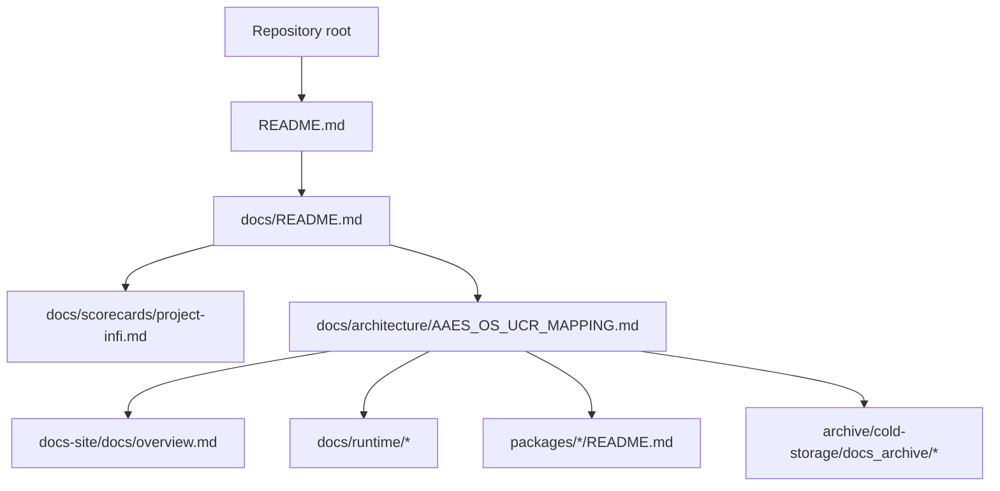

# AAES-OS UCR Mapping

This document maps the current `E:\project-infi` repo layout to the live documentation surface and records the build, implementation, and wiring plan for the repo.

## What is current

| Surface | Current location | Doc home |
|---|---|---|
| Repository entrypoint | [`README.md`](../../README.md) | Root summary plus docs hub links |
| Docs hub | [`docs/README.md`](../README.md) | Canonical documentation index |
| Repo scorecard | [`docs/scorecards/project-infi.md`](../scorecards/project-infi.md) | Readiness and evidence baseline |
| Published docs site | [`docs-site/docs/overview.md`](../../docs-site/docs/overview.md) | User-facing docs navigation |
| Governance runtime | `packages/aaes-governance`, `packages/ucr-runtime`, `packages/tri-core-protocol` | Runtime and evidence spine |
| Coding surface | `packages/governed-runtime`, `packages/coding-assistant`, `packages/nova-shell`, `packages/infinity-agents`, `packages/architect-agent` | Local and governed coding workflow |
| Legacy runtime notes | `docs/runtime/legacy/ai-organism.md` | Archived runtime note |
| Legacy architecture note | `docs/architecture/legacy/coding-assistant-architecture.md` | Archived architecture note |
| Archived pitch/spec deck | `archive/cold-storage/docs_archive/workspace_pull/project-infi-root/DARPA-READY ARCHITECTURE SUMMARY.docx` | Cold storage |

## Architecture tree summary

The legacy architecture note content now lives here in a more explicit form:

| Legacy topic | Current repo surface | Notes |
|---|---|---|
| Planet-Scale Organism Mesh (PSOM) | `packages/psom-mesh`, `packages/platform-mesh`, `services/platform-web` | Mesh discovery, routing, load balancing, drift, quarantine, and developer views |
| Self-Governing Capability Economy (SGCE) | `packages/sgce`, `packages/platform-core` | Tokens, marketplace, provenance, pricing, lifecycle, and semver control |
| Developer surface | `packages/platform-sdk`, `packages/platform-cli`, `services/platform-api`, `services/platform-web` | REST API, CLI, SDK, and dashboard surfaces |
| Governance core | `packages/aaes-governance`, `packages/ucr-runtime`, `packages/tri-core-protocol` | Invariant engine, runtime spine, and governance triad |
| Runtime integration | `packages/governed-runtime`, `packages/coding-assistant`, `packages/nova-shell`, `packages/infinity-agents`, `packages/architect-agent` | Local and governed coding workflow |
| Docs entrypoints | `docs/README.md`, `docs-site/docs/overview.md`, `docs/architecture/README.md` | Current docs navigation and filing index |

### Legacy section carryover

- The old PSOM layer is still the mesh-oriented architecture story, but the live package names are now `platform-mesh` and `psom-mesh` rather than the older concept-only labels.
- The old SGCE layer still maps to capability tokenization and marketplace ideas, but the repo now expresses that work through current platform and governance packages.
- The old developer surface is now split across docs-site, platform API, platform CLI, and platform SDK.
- The old architecture note should be treated as background context, not as the active canonical repo layout.

## Wiring model

## Build plan

1. Keep the root workspace as the authoritative build entrypoint.
2. Build the TypeScript workspace with `corepack pnpm build`.
3. Build the docs site with `corepack pnpm --dir docs-site build`.
4. Run the repo test suite with `corepack pnpm test`.
5. Run the docs coverage pass with `corepack pnpm coverage:docs`.
6. Re-run focused package builds or tests when a specific subsystem changes.

## Implementation plan

1. Preserve the standard root docs at repository root: `README.md`, `CHANGELOG.md`, `CONTRIBUTING.md`, `SECURITY.md`, and `SUPPORT.md`.
2. Keep current repo-wide explanation in the docs hub and scorecard.
3. Route runtime-focused narrative into `docs/runtime/`.
4. Route architecture bridge material into `docs/architecture/`.
5. Move legacy or speculative notes out of the root and into legacy or archive paths.
6. Keep the docs site linked to the same canonical evidence surfaces so the published docs and repo docs stay in sync.

## Wiring checklist

- `README.md` points to `docs/README.md`, the scorecard, and this mapping.
- `docs/README.md` points to the scorecard, docs-site overview, and this mapping.
- `docs-site/docs/overview.md` remains the public-facing docs entrypoint.
- `docs/architecture/legacy/coding-assistant-architecture.md` captures the older architecture note without polluting the current baseline.
- `docs/runtime/legacy/ai-organism.md` captures the runtime note without making it look like the active canonical entrypoint.

## Verification

- `corepack pnpm build`
- `corepack pnpm --dir docs-site build`
- `corepack pnpm test`
- `corepack pnpm coverage:docs`
- `git diff --check`
