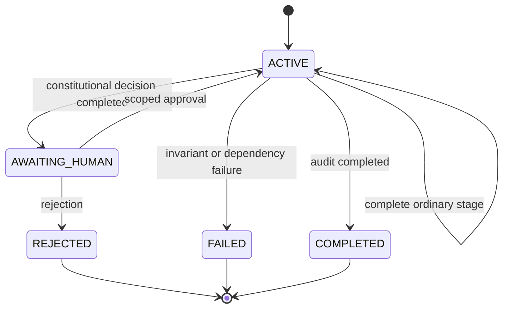
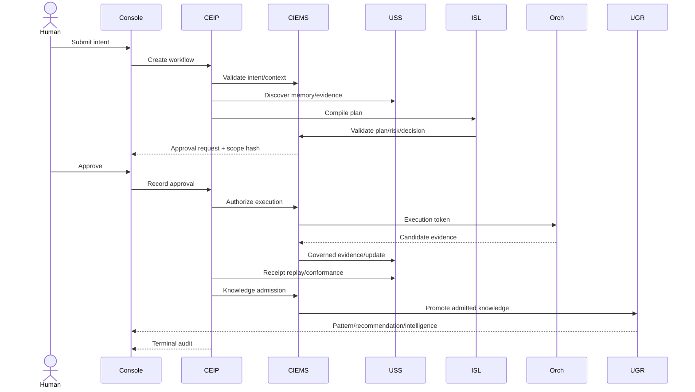

# CEIP v1.0 Reference Runtime

Status: FROZEN reference implementation; production readiness not claimed  
Authority: integration contract over the frozen Constitutional AI Runtime  
Canonical lifecycle: `Intent → Constitutional Context → Institutional Memory Discovery → Evidence Discovery → Constitutional Planning → Risk Assessment → Constitutional Decision → Human Approval → Execution → Evidence Package → Constitutional Receipt → Replay → Conformance → Knowledge Admission → UGR Institutional Memory → Pattern Discovery → Constitutional Recommendation → Executive Intelligence → Audit`

CEIP coordinates existing runtime services. It is not a new authority layer, graph engine, planner, memory system, or execution bypass. Each transition produces an immutable event and links its inputs, outputs, evidence, actor, timestamp, and receipt.

Freeze notice: [CEIP v1.0 Freeze](./CEIP_V1_FREEZE.md). Production-candidate program: [CEIP PC-1](./CEIP_PC1_PLAN.md).

## Complete runtime interaction diagram

```mermaid
flowchart LR
  OP["Operator / Twin Console"] --> GW["API Gateway"]
  GW --> INT["Intent + Context"]
  INT --> MEM["USS/UGR memory discovery"]
  MEM --> EVD["Evidence discovery"]
  EVD --> ISL["ISL constitutional planning"]
  ISL --> RISK["CIEMS risk + decision"]
  RISK --> HUMAN{"Human approval"}
  HUMAN -->|approve| EXEC["Orchestration + adapters"]
  HUMAN -->|reject| AUDIT["Audit / terminal rejection"]
  EXEC --> PACKAGE["Evidence package + receipt"]
  PACKAGE --> REPLAY["USS replay"]
  REPLAY --> CONF["Conformance suite"]
  CONF --> ADMIT{"Knowledge admission"}
  ADMIT -->|admit| UGR["UGR institutional memory"]
  ADMIT -->|defer/reject| AUDIT
  UGR --> PATTERN["Pattern discovery"]
  PATTERN --> REC["Constitutional recommendation"]
  REC --> EI["Executive intelligence"]
  EI --> AUDIT
  INT -. events .-> OP
  EXEC -. events .-> OP
  PACKAGE -. receipts .-> OP
  UGR -. promotion .-> OP
```

## Service dependency map

| CEIP responsibility | Existing authority/service | Dependencies |
|---|---|---|
| Intent and context | IntentService + CIEMS IntentKernel | Identity, USS context snapshot, constitution version |
| Memory/evidence discovery | USS Query + UGR projection | actor/mission scope, admissibility policy |
| Planning | ISL Compiler + Registry | validated capabilities, evidence preconditions |
| Risk and decision | CIEMS Plan/Governance gates | sovereignty, risk, CIC, CCC, compliance |
| Human approval | Gateway Approval API | authenticated human, immutable approval scope hash |
| Execution | ExecutionKernel + Orchestration | approved plan, short-lived token, adapters |
| Package/receipt | EvidenceService + receipt library | admitted evidence, hashes, constitution/conformance versions |
| Replay/conformance | USS Replay + CEIP suite | versioned updates, canonical events |
| Admission/memory | USSKernel + UGR | knowledge-admission decision and lineage update |
| Pattern/recommendation/intelligence | Learning/Reflection projections | admitted knowledge only; no direct authority |
| Audit | Audit/Telemetry Store | full event chain and receipt verification |

No service may skip forward to a downstream stage. Read services cannot mutate USS. Learning and recommendation outputs return as candidate constitutional objects; they do not self-authorize.

## Canonical events and object schemas

The TypeScript authority is `@aaes-os/ceip-runtime`:

- `CeipEvent`: event ID/type, workflow/stage/sequence, actor/time, transition, objects, evidence, payload.
- `CeipTransition`: from/to state, input/output references, evidence, receipt, reason.
- `ConstitutionalObjectRef`: object ID/type, URI, integrity hash, creation time.
- `CeipWorkflow`: current stage/state, monotonic sequence, transitions, linked objects.
- `HumanApproval`: approver identity, decision, approval scope hash, time, comment.
- `ConstitutionalReceipt`: intent/decision/plan/execution/evidence hashes, constitution and conformance versions, integrity hash.
- `KnowledgeAdmission`: candidate objects, disposition, epistemic status, admitting authority, lineage update.

Events are append-only and at-least-once deliverable. Consumers deduplicate by `eventId`; ordering is per workflow via `sequence`. Payloads never replace canonical object storage.

## State machines

Execution is reachable only after a matching human approval. Knowledge admission is reachable only after receipt, replay, and conformance. UGR promotion is reachable only after an `ADMIT` disposition. Audit is terminal.

## Operator workflow

The Twin Console is the primary projection. An operator can:

1. Open a workflow and inspect its current state, actor, constitution, risk, and pending action.
2. Expand any stage to view input/output objects, hashes, evidence, transition reason, and receipt.
3. Approve or reject only at Human Approval, with the approval bound to the plan/decision scope hash.
4. Follow live state events without treating WebSocket delivery as authoritative storage.
5. Open the evidence package and verify its constitutional receipt.
6. Replay state at the execution and admission boundaries.
7. Inspect conformance findings and block promotion on any required failure.
8. Review knowledge admission and the resulting UGR lineage update.
9. Trace patterns, recommendations, and executive intelligence back to admitted evidence.
10. Export the terminal audit chain.

## API specification

| Method and path | Purpose |
|---|---|
| `POST /ceip/workflows` | Create from an accepted Intent |
| `GET /ceip/workflows/{workflowId}` | Read state and linked constitutional objects |
| `GET /ceip/workflows/{workflowId}/events` | Read ordered canonical events |
| `POST /ceip/workflows/{workflowId}/advance` | Complete an authorized non-human stage |
| `POST /ceip/workflows/{workflowId}/approval` | Record scoped human approve/reject decision |
| `GET /ceip/objects/{objectId}` | Inspect an object and its lineage |
| `GET /ceip/receipts/{receiptId}` | Retrieve and verify a receipt |
| `POST /ceip/workflows/{workflowId}/replay` | Reconstruct state at sequence/time |
| `POST /ceip/workflows/{workflowId}/conformance` | Run the pinned conformance profile |
| `POST /ceip/workflows/{workflowId}/admission` | Admit, defer, or reject knowledge candidates |
| `GET /ceip/workflows/{workflowId}/audit` | Return the terminal audit package |

Commands require an idempotency key, authenticated actor, expected workflow version, and correlation ID. State conflicts return `409`; policy rejection `403`; invalid transitions `422`.

## Runtime sequence

## Deployment architecture

CEIP runs as a stateless coordinator in the secure control plane, behind the API Gateway and beside CIEMS/ISL—not inside the substrate plane. Workflow/event state is stored in the append-only audit store; canonical objects remain in their owning services. Approval endpoints require human OIDC assurance and separation of duties. Mesh policy permits CEIP to call only published service APIs. It cannot call substrates or write USS directly.

Production deployment requires multiple coordinator replicas, optimistic workflow versions, idempotent commands, an outbox for canonical events, dead-letter handling, mTLS, short-lived workload identity, encrypted object references, trace correlation, rate limits, backups, and fail-closed dependency behavior.

## Conformance suite

Required rules include:

- `CEIP-ORDER`: canonical stage order is preserved.
- `CEIP-HUMAN-GATE`: execution follows matching human approval.
- `CEIP-EVIDENCE`: receipts follow linked evidence packages.
- `CEIP-ADMISSION`: UGR promotion follows governed knowledge admission.
- `CEIP-AUDIT`: completed workflows terminate with audit.
- Rejection, missing evidence, stale approval, duplicate event, replay mismatch, failed conformance, and unauthorized promotion negative cases.

The reference implementation currently supplies the deterministic lifecycle, contracts, and baseline conformance checks. Production readiness additionally requires persistence, API transport, service adapters, load/failure testing, security review, deployment evidence, and independent verification.

## Reference implementation guide

Use `CeipStateMachine.start` for an accepted Intent. Each service adapter completes exactly one stage and supplies output object/evidence references. Persist transition plus outbox event atomically. At `HUMAN_APPROVAL`, call `approve`; never synthesize approval from Twin consensus. After execution, create the evidence package and cryptographic receipt using the evidence-receipts library. Replay from USS, pin a conformance profile, record knowledge admission, and only then promote into UGR. Finish with an audit object containing every transition, event, object hash, receipt verification, conformance finding, and admission lineage ID.
