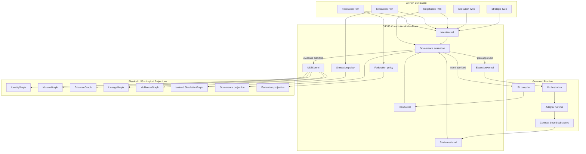

# CIEMS Kernel Architecture

The governing path is `Intent → Governance → ISL Plan → Governance → Authorized Execution → Evidence → Governance → USS Update`. Governance is a membrane around each boundary, not a downstream cleanup stage.

Twins never address physical or projected graphs directly. Queries pass through authorized USS services; mutations require admissible evidence and USSKernel continuity approval. Federation imports require provenance, governance alignment, and unanimous admission. Simulations write only to the isolated SimulationGraph.

`Governance projection` and `Federation projection` are composed from CIEMS configuration, Identity, Evidence, and Lineage records. They do not add physical graph engines to the frozen runtime.
